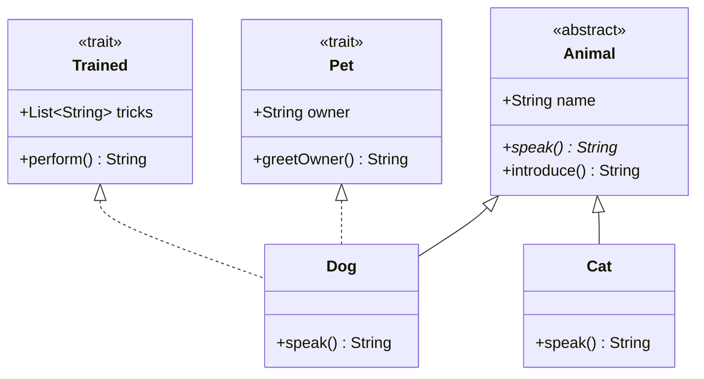

```mermaid
classDiagram
    class Animal {
        <<abstract>>
        +String name
        +speak() String*
        +introduce() String
    }
    class Pet {
        <<trait>>
        +String owner
        +greetOwner() String
    }
    class Trained {
        <<trait>>
        +List~String~ tricks
        +perform() String
    }
    class Dog {
        +speak() String
    }
    class Cat {
        +speak() String
    }
    Animal <|-- Dog
    Animal <|-- Cat
    Pet <|.. Dog
    Trained <|.. Dog
```
